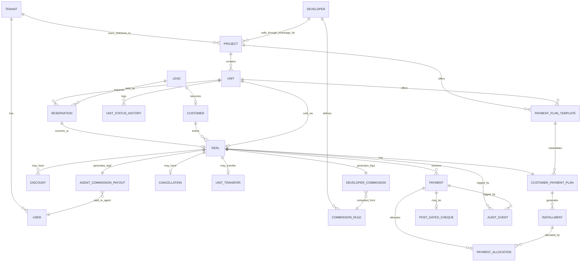

> **SUPERSEDED — September 2026 product-direction revision.**
> Replaced by revision 2 of `16_Canonical_Domain_Model.md`. Key differences: `Developer`
> is optional and required only for brokered projects; `Project` carries a commercial
> model; the `DeveloperCommission` / `AgentCommissionPayout` pair is replaced by a single
> `Commission` entity with a direction.

# 08 — Data Model

**Subject:** Conceptual entity-relationship model combining BRD v0.1's existing entities (Appendix A/B) with the new money-model entities from `04`. This is conceptual, not a physical schema — types, indexes, and normalization decisions belong to implementation.

---

## 1. Entity catalog

For each entity: **Why it exists**, key conceptual attributes, relationships, and phase (MVP/P2/Future). Entities marked *(BRD)* already exist in BRD v0.1 Appendix A and are only briefly restated for context; entities marked *(NEW)* are introduced by this discovery.

### Tenancy & identity *(BRD, unchanged)*
- **Tenant** — roots all data. *(MVP)*
- **User**, **Membership**, **Role**, **Branch** — existing BRD scope. *(MVP)*

### CRM core *(BRD, unchanged)*
- **Lead**, **Contact**, **LeadStage**, **LeadSource**, **Activity**, **Task** — existing BRD scope. *(MVP)*
- **Customer** *(NEW, evolution)* — Why: BRD's `Contact` becomes a `Customer` once a Deal exists; carries buyer-specific attributes (national ID reference, co-buyer links). Relationships: 1 Customer → many Deals. *(MVP)*

### Inventory
- **Developer** *(NEW)* — Why: anchors commercial terms (`05`§2). Attributes: name, contact, standard commission rate/range, commission tranche policy. Relationships: 1 Developer → many Projects; 1 Developer → many CommissionRules. *(MVP)*
- **Project** *(BRD, extended)* — add `developer_id`. Relationships: 1 Project → many Units; 1 Project → many PaymentPlanTemplates. *(MVP)*
- **Phase** *(BRD, unchanged)* — sub-grouping within a Project. *(MVP)*
- **Unit** *(BRD, extended)* — add link to applicable PaymentPlanTemplates. Attributes: price, type/size/floor/view, status (available/reserved/sold/cancelled). Relationships: 1 Unit → many Reservations (over time); 1 Unit → 0..1 active Deal. *(MVP)*
- **UnitStatusHistory** *(BRD, unchanged)* — append-only log of status transitions, now also triggered by Deal/Cancellation events. *(MVP)*

### Payment plan engine
- **PaymentPlanTemplate** *(NEW)* — Why: reusable plan definition per Project/Unit (`04`§3.3). Attributes: type (cash/down+installments/hybrid/milestone), down_payment_pct_or_amount, installment_count, frequency, duration, delivery_linked_pct, market_shorthand_label. Relationships: many-to-many with Project/Unit; 1 Template → many CustomerPaymentPlans (instances). *(MVP)*
- **CustomerPaymentPlan** *(NEW)* — Why: the customer-specific instance attached to one Deal (`04`§3.6); kept distinct from the Template so template edits never retroactively change a live deal. Attributes: resolved price, resolved down payment, discount applied, version number. Relationships: 1 Deal → 1 active CustomerPaymentPlan (+ historical versions, P2); 1 CustomerPaymentPlan → many Installments. *(MVP)*
- **Installment** *(NEW)* — Why: one expected schedule line (`04`§3.7, the "expected layer"). Attributes: due_date, expected_amount, status (derived: pending/partial/paid/overdue), plan_version. Relationships: many Installments → 1 CustomerPaymentPlan; many-to-many with Payment via allocation. *(MVP)*
- **Discount** *(NEW)* — Why: modifies price/plan pre-generation (`04`§3.10). Attributes: type (fixed/%), amount, reason, applied_by, applied_at. Relationships: 1 Discount → 1 Deal. *(MVP)*

### Deals & reservations
- **Reservation** *(BRD, unchanged)* — hold, pre-contract. Relationships: 1 Lead + 1 Unit → 1 Reservation. *(MVP)*
- **Deal** *(NEW, aka Sale)* — Why: the confirmed contract, distinct from Reservation (`04`§3.4, `05`§3). Attributes: agreed price, collection_owner flag (developer_collects/brokerage_collects), status (active/cancelled/completed). Relationships: 1 Customer + 1 Unit + 0..1 Reservation → 1 Deal; 1 Deal → 1 CustomerPaymentPlan; 1 Deal → 1 DeveloperCommission; 1 Deal → 1 AgentCommissionPayout. *(MVP)*
- **Cancellation** *(NEW)* — Why: captures cancellation lifecycle (`04`§3.11, §7). Attributes: reason, grace_period_end, computed_refund_amount, status. Relationships: 1 Deal → 0..1 Cancellation. *(P2)*
- **UnitTransfer** *(NEW)* — Why: swap Deal to a new Unit, optional credit-forward (`04`§3.12). Relationships: 1 old Deal + 1 new Unit → 1 UnitTransfer → 1 new Deal. *(Future)*

### Collections
- **Payment** *(NEW, aka Receipt)* — Why: the "actual layer" (`04`§3.8, §1). Attributes: amount, payment_date, method (bank/cash/cheque/PDC), collected_by (brokerage/developer), proof_document_id. Relationships: many Payments → 1 Deal; many-to-many with Installment via allocation (an allocation table/join, since one payment can cover multiple installments and vice versa for partials). *(MVP)*
- **PaymentAllocation** *(NEW, join entity)* — Why: explicit many-to-many link so partial/overlapping allocations are auditable (`04`§3.8, D2/D9/D10). Attributes: allocated_amount. Relationships: 1 Payment ↔ 1 Installment per row. *(MVP)*
- **PostDatedCheque** *(NEW)* — Why: PDC sub-lifecycle (`04`§3.9). Attributes: cheque_number, bank, maturity_date, deposit_date, status (issued/deposited/cleared/bounced). Relationships: 1 Payment → 0..1 PostDatedCheque. *(P2, pending confirmation)*

### Commission
- **CommissionRule** *(BRD placeholder, now defined)* — Why: rate/tier definition, owned by Developer (Leg 1) or by the brokerage's internal policy (Leg 2, `04`§6). Attributes: rate/tiers, trigger type (deal-based/collection-based). Relationships: 1 Developer → many CommissionRules (Leg 1); brokerage-internal rules for Leg 2 (may be tenant-level, not developer-level). *(MVP, basic)*
- **DeveloperCommission** *(NEW)* — Why: Leg 1, brokerage's receivable from the developer (`04`§6). Attributes: expected_amount, state (expected/accrued/invoiced/received/overdue), tranche schedule. Relationships: 1 Deal → 1 DeveloperCommission. *(MVP)*
- **AgentCommissionPayout** *(NEW)* — Why: Leg 2, brokerage's payable to agent/team leader (`04`§6). Attributes: split rule reference, expected_amount, state (expected/accrued/payable/paid/clawback). Relationships: 1 Deal → 1 AgentCommissionPayout; 1 AgentCommissionPayout → 1 primary Agent (+ optional team-leader split). *(MVP)*

### Documents, notifications, audit *(BRD, extended)*
- **Document** *(BRD, extended)* — now also covers Statements of Account, PDC images, refund computations. *(MVP)*
- **Notification** *(BRD, extended)* — now also covers overdue-installment reminders, commission-tranche-due alerts. *(MVP, per `07` F/N sections)*
- **AuditEvent** *(BRD, extended)* — now mandatorily covers every money-model mutation (`07` N3). *(MVP)*

### AI layer *(BRD, unchanged scope; see `12_Claude_Skills.md` for how this discovery's own tooling relates)*
- **AiJob**, **AiPromptTemplate**, **AiUsageLog** *(BRD, unchanged)*. *(MVP thin / P2 expand)*

---

## 2. Conceptual ERD

*(Diagram is conceptual — cardinalities are simplified for readability; e.g., a Deal may have multiple Discounts over time, and a CustomerPaymentPlan may have multiple historical versions once B10/plan-versioning ships.)*

---

## 3. Entity phase summary

| Phase | Entities |
|---|---|
| **MVP** | Tenant, User, Membership, Role, Branch, Lead, Contact, Customer, Activity, Task, Developer, Project, Phase, Unit, UnitStatusHistory, PaymentPlanTemplate, CustomerPaymentPlan, Installment, Discount, Reservation, Deal, Payment, PaymentAllocation, CommissionRule, DeveloperCommission, AgentCommissionPayout, Document, Notification, AuditEvent |
| **P2** | PostDatedCheque, Cancellation, (plan versioning as an attribute of CustomerPaymentPlan) |
| **Future** | UnitTransfer, multi-currency extensions |

---

## 4. Design notes carried from `04`

- Outstanding/Overdue are **not** entities — they are computed views over Installment + PaymentAllocation (`04`§1, §5). Do not create a table for them beyond an optional materialized/cached reporting layer.
- PaymentAllocation exists specifically so that partial payments and one-payment-covers-multiple-installments (or one-installment-covered-by-multiple-payments) cases are representable without ambiguity — this was a deliberate addition beyond BRD's existing modeling style, justified by the AR-domain pattern in `03`§Tier-3 and `02`§12.
- CommissionRule is reused from BRD's own Appendix A placeholder (previously undefined) rather than introduced as a brand-new name, to minimize unnecessary vocabulary divergence from the existing document (see `14_BRD_Change_Proposal.md`).
